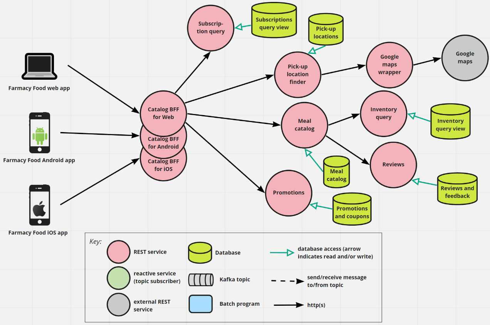

# Catalog Microservice View 
The scope is the various query/browsing operations that an app user can perform: browsing or searching for meals,
browsing promotions and coupons, looking at subscrition plans, pick-up location finder. 
 
This is a microservice architecture. Key patterns used:
- BFF
- Database per Microservice (aka Database per Service)
- CQRS 
- Wrapper (aka Legacy Wrapper, Anticorruption Layer)

## Element Catalog 

#### Pick-up location finder
- Has endpoints to list and search for pick-up locations near a given address or in a given region (city, state).
- The database of pick-up locations is updated by another component (not shown in the diagram). (Being honest, in a 
start up setting, it might as well be that for a while there won't be any UI for updating locations and this kind of 
data repository will be updated manually.)

#### Google maps wrapper
- Handles all interaction with the [Google maps external service](https://developers.google.com/maps/solutions/store-locator), 
used for retrieving plotted maps with pick-up locations.
- Contains all the specifics to interact with Google maps (API key, GeoJSON data transformation, etc.)
- Exposes a standardized interface for location finder functionality to the BFFs (and hence the frontends).  

#### Google maps
- External [service](https://developers.google.com/maps/solutions/store-locator) that provides geolocation services via an API. 
- Interaction options to be further designed. 

## Behavior
- N/A.
 
## Related ADRs 
- [Wrapper pattern](../ADRs/ADR003-wrapper-pattern.md)
- [BFF pattern](../ADRs/ADR002-bff-pattern.md)

## Related Views
- [Customer Account Management - microservice view](user-account-mgmt-runtime-view.md)
- [Order - microservice and EDA view](order-runtime-view.md)
 
