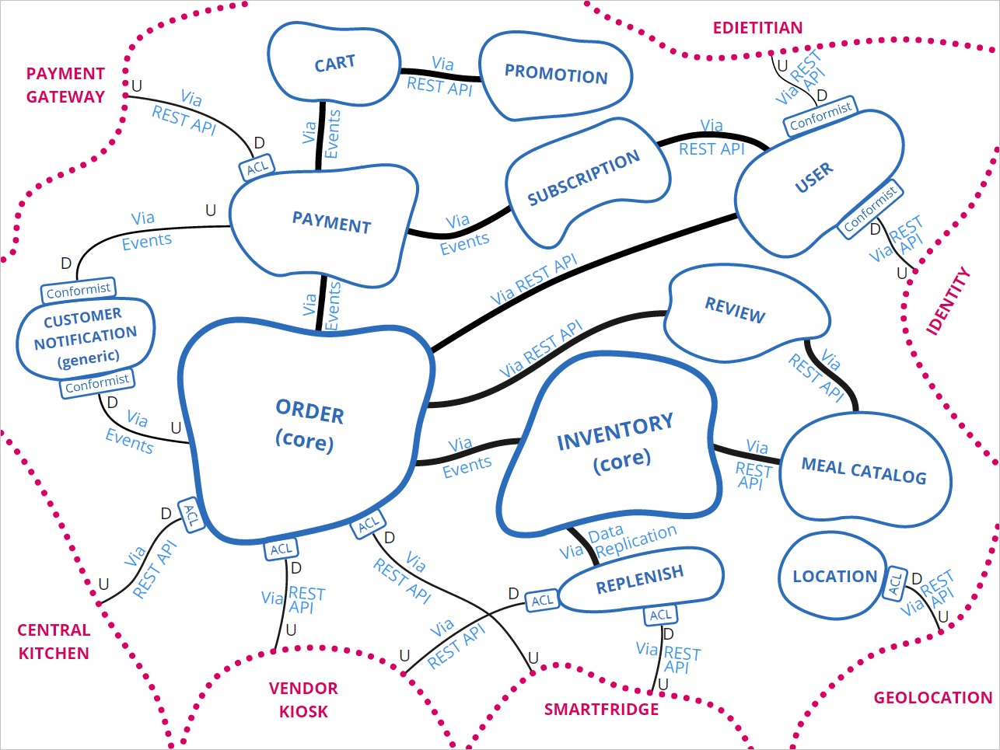
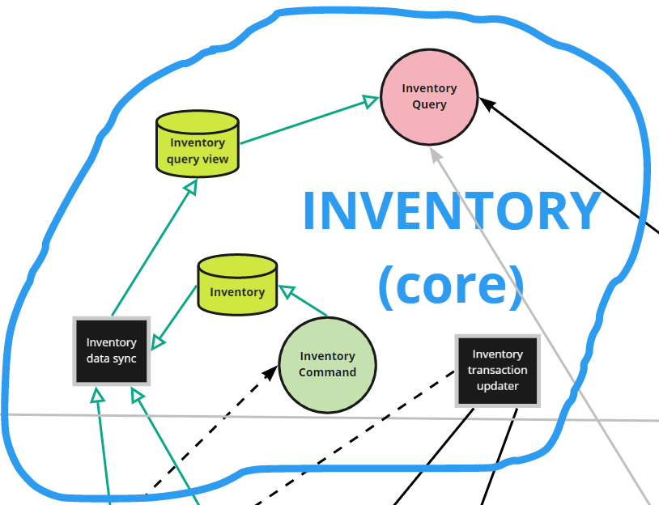
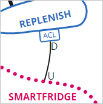

# DDD Context Map

<!-- Short description of the scope and nature of this architecture view. --> 

This architecture view is a [DDD Context Map](https://learning.oreilly.com/library/view/patterns-principles-and/9781118714706/c07.xhtml). 
It shows how the Farmacy Food system is broken up into bounded contexts (BCs) and how they interact with each other. 

_Subdomains_ reflect and divide the areas of business that are of importance to our system. 

_Bounded Contexts_ (BCs) establish the scope of validity of each of the models in our solution. They make
it clear where every context begins and ends. Business strategy, team dynamics and other technical
aspects are relevant in the design of these boundaries.

The BCs can be seen as the logical grouping of the microservices and components portrayed in other views.

Subdomains exist in the problem space and BCs in the solution space. Ideally, the scope of one BC matches the 
domain model of one subdomain. Therefore,
in our context map, the subdomains *that will be implemented by Farmacy Food* are each defined exactly as one BC. 

Our model defines ***Inventory*** and ***Order*** as core bounded contexts.
The decision of which BCs are core requires strategic vision, and should be made under
the guidance of _domain experts_. Our proposal shows these two BCs as core because we believe Farmacy Food's
main business challenge is of a logistics nature.

## Element Catalog 

### Internal Subdomains and BCs

##### Meal Catalog
- Manages the catalog of meals that Farmacy Food offers, with information about ingredients, nutrition facts, price, and more.
- It's a supporting domain BC.

##### Inventory
- Controls what meals are available in each smart fridge and vendlor location.
- It's a core domain BC.

##### User
- Mainly handles user profile information. For customers, that includes dietary and health information.
- It's a supporting domain BC.

##### Review
- Manages meal reviews and ratings; surveys.
- It's a supporting domain BC.

##### Order
- Processes orders, keeping track of the global status of all transactions.
- It's a core domain BC.

##### Cart
- Handles the shopping cart and checkout process for purchases made using the Farmacy Food app.
- It's a supporting domain BC.

##### Subscription
- Manages plans available and ongoing customer subscriptions.
- It's a supporting domain BC.

##### Payment
- Processes the payment for orders placed on the app and subscription-originated purchases.
- It's a supporting domain BC.

##### Promotion
- Manages promotions and coupons.
- It's a supporting domain BC.

##### Location
- Has the listing of pick-up locations available, and provides the customer with the ability to find a location.         
- It's a supporting domain BC.

##### Replenish
- Updates the status of smart fridges and vendor kiosks when a Farmacy Food employee replenishes these locations.
- It's a supporting domain BC.

##### Customer Notification
- Notifies the customer of updates on their orders, subscriptions, payments, etc.
- It's a generic subdomain BC.

#### Subdomains from external systems

##### Payment Gateway
- External partner that handles customer payments.
        
##### Smartfridge
- Cloud management system for Smartfridges.

##### Vendor Kiosk
- Cloud management system for Vendor Kiosks.

##### Central Kitchen
- Farmacy Food central kitchen management system.

##### Geolocation
- Maps and location finding services.

##### Identity
- Authentication using third-party identitiy, such as Google or Facebook.
         
##### eDietitian
- Expert system that would generate meal recommendations based on user preferences, health info, and history.

#### Partnership (BC Relationship)

- TODO GENERATE IMAGE
- A *Partnership* between two BCs indicates that the teams that own such BCs intend
to work closely. In this dynamic, the (likely common) goals of both teams are fulfilled without any kind of priority of one team over the other.
- Given Farmacy Food is a startup, we understand it will most likely have only one development team. With this in mind, we identified most of the
relationships between the designed BCs as partnerships.

#### Conformist (BC Relationship)

- The Conformist relationship between two bounded contexts (or subdomains) indicates that the _upstream_ (**`U`**) end's
model is accepted/absorbed without translation by the _downstream_ (**`D`**) counterpart.
- In our model, this relationship is used in three scenarios. The integration with the _Identity_
subdomain, mostly because the solutions in this subdomain, e.g. OAuth, are typically widely known and accepted.
The _eDietitian_ subdomain is expected to require some information to generate their decisions and it our system should 
provide that data as needed. Lastly, given the *Customer Notification* BC is expected
to be generic, some off-the-shelf tool would likely provide the means of integrating with our BCs with minimal effort.

#### Anticorruption Layer - ACL (BC Relationship)

- An anticorruption layer is used to translate the _upstream_ (**`U`**) model to and from the terms (ubiquitous language)
of the _downstream_ (**`D`**) model. Its goal is to avoid undesirable coupling in the BC implementation toward  
the external model.

#### Types of Integration Mechanisms between BCs

Our context map mainly shows relationships between the BCs. To make it more complete,
we have also specified in the diagram the technical mechanisms used to integrate each subdomain.

- **Via REST API**
    
    
    - This label shows that two BCs are mainly integrated via REST API calls.
    
- **Via Events**

    
    - Denotes BCs integrated via Domain Events following the publish-subscribe messaging pattern.

- **Via Data Replication**
    
    
    - There are a few cases in which the integration is achieved via Data Replication, using a batch program for data synchronization.

## Behavior
- N/A.
 
## Related ADRs 
- [Microservice style](../ADRs/ADR001-microservice-style.md)
- [Wrapper pattern](../ADRs/ADR004-wrapper-pattern.md)
- [Payment gateway](../ADRs/ADR002-payment-gateway.md)

<!--
- [AWS as the cloud provider](../ADRs/ADR006-aws-as-cloud-provider.md)
- [BFF pattern](../ADRs/ADR002-bff-pattern.md)cu
- [CQRS pattern](../ADRs/ADR005-cqrs-pattern.md)

-->

## Related Views
- [Context Diagram](context-diagram.md)
- [Hexagonal reference architeture view](hexagonal-reference-architecture.md)
- [User Account Management - microservice view](user-account-mgmt-microservice-view.md)
- [Catalog - microservice view](catalog-microservice-view.md)
- [Order - microservice and EDA view](order-microservice-eda-view.md)
- [Customer at Pick-up Location Microservice and EDA View](customer-pickup-microservice-eda-view.md)
- [Replenisher - microservice and EDA view](replenish-microservice-eda-view.md)

<!--
- [AWS Deployment view](aws-deployment-view.md)
--> 
